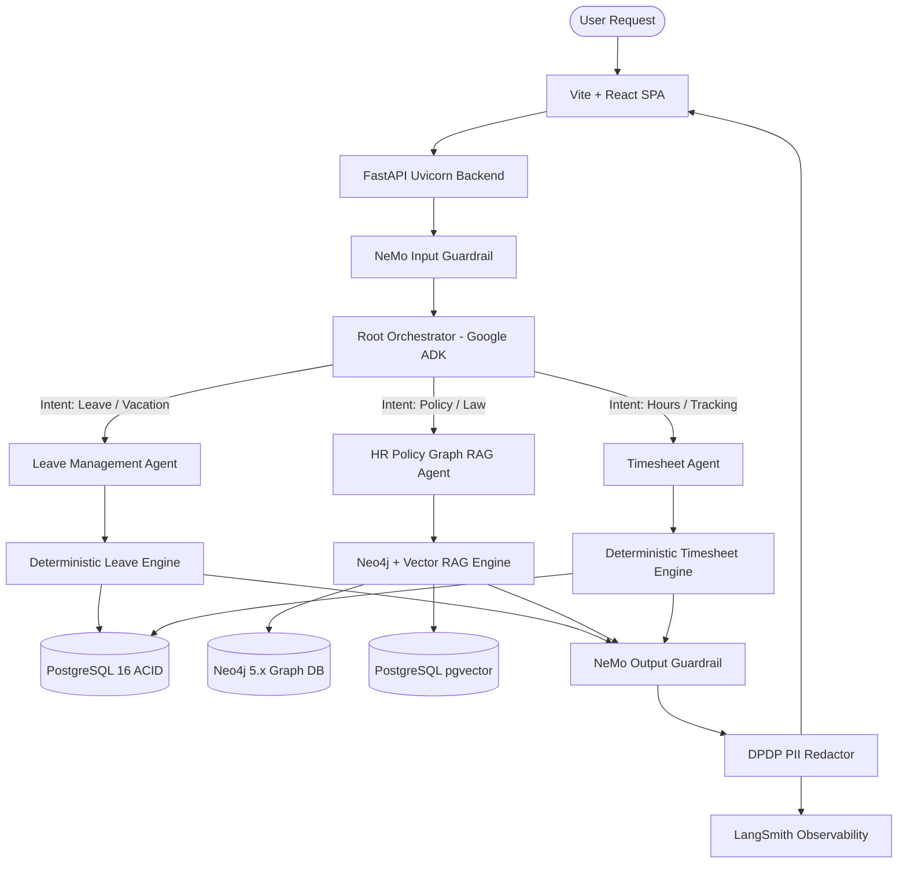

# System Architecture & Multi-Agent Design

## 1. Multi-Agent Orchestration with Google ADK

The system is architected following the **Google Agent Development Kit (ADK)** hierarchical pattern:

---

## 2. Specialized Agents & Tool Contracts

### 2.1 Root Orchestrator Agent
- **Framework**: Google ADK
- **Role**: Coordinates high-level conversations, conducts intent detection, manages session context, and delegates tool execution to domain specialists.
- **Fail-Safe**: If the user prompt exhibits safety threats, the orchestrator terminates the trajectory before calling sub-agents.

### 2.2 Leave Management Agent
- **Role**: Authoritative leave ledger manager.
- **Rules Enforced**:
  - Validates date order (`start_date <= end_date`).
  - Verifies date overlap with existing `SUBMITTED` or `APPROVED` leaves.
  - Checks real-time balances for **Earned Leave (EL)**, **Casual Leave (CL)**, and **Sick Leave (SL)**.
  - Permits uncapped **Leave Without Pay (LWP)** subject to managerial concurrence.
  - Generates structured action JSON payloads requiring client-side confirmation.

### 2.3 HR Policy Agent (Graph RAG)
- **Role**: Legal and policy information retrieval.
- **Knowledge Representation**:
  - **Statutory Law**: *Maharashtra Shops and Establishments Act, 2017* (Sections 13, 15, 18).
  - **Company Policy**: *Enterprise Leave & Working Hours Manual 2026*.
  - **Relationships**: Mapped via Neo4j Cypher (`(:Policy)-[:DERIVED_FROM]->(:Act)`, `(:LeaveType)-[:SUBJECT_TO]->(:Condition)`).
- **Mandatory Guardrails**:
  - Enforces non-legal advice disclaimers.
  - Escalates ambiguous or dispute-related topics to human HR partners.

### 2.4 Timesheet Agent
- **Role**: Employee hour tracking and managerial reporting.
- **Rules Enforced**:
  - Daily logging limit: 16 hours maximum across projects.
  - Duplicate prevention: Rejects multiple entries for the same project, task, and date.
  - Aggregation engine: Summarizes billable vs. non-billable percentages and exports official CSV files.

---

## 3. Data Storage Architecture

1. **PostgreSQL 16**: Primary relational store for `users`, `employee_profiles`, `documents`, `leave_balances`, `leave_applications`, `projects`, `timesheet_entries`, and `audit_logs`.
2. **Neo4j 5.x**: Graph database for statutory knowledge nodes, policy rules, and multi-hop relationship traversals.
3. **MinIO S3**: Object storage for KYC documents (Aadhaar, PAN, Resumes) with SHA-256 integrity validation.
